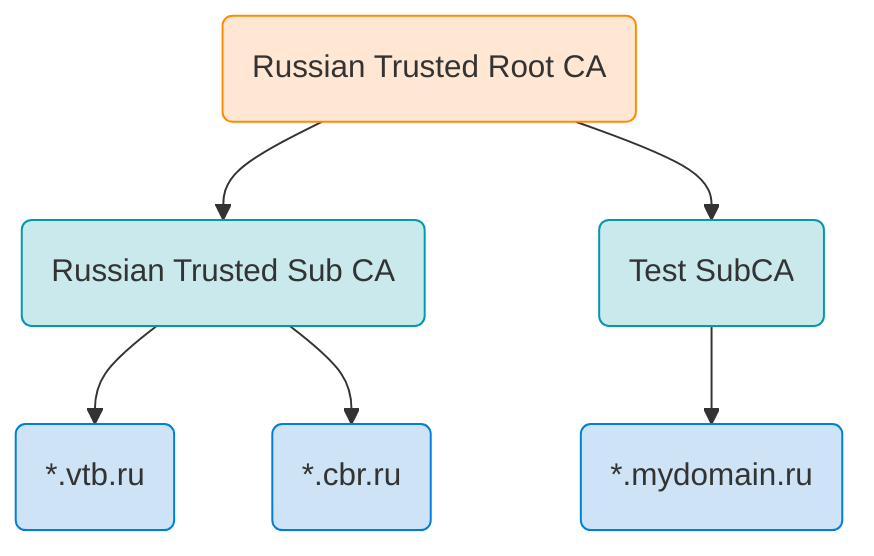

# Russian Trusted Root CA

Raw files related to the newly introduced Russian national certificate authority.

Read my blog post: [Russia's certificate authority for sanctioned organizations](https://koen.engineer/russias-certificate-authority-for-sanctioned-organizations-645d61af8ac6)

## Hierarchy



## Certificates

### CA certificates

* Russian Trusted Root CA - [PEM-encoded certificate](root-ca_rsa-2022.pem) 
* Russian Trusted Sub CA - [PEM-encoded certificate](sub-ca_rsa-2022.pem)
* Test SubCA - [PEM-encoded certificate](test-sub-ca_rsa-2022.pem)

### Issued certificates

* [List of issued certificates spotted in the wild](certificates.tsv)
* [All issued certificates in PEM-encoded form](certificates)

## Yandex

Encrypted configuration files can be decrypted as follows.

```bash
cd ./yandex

key=".5I(oR[LGJ7gGr4*Q-Tw90M8VNa6D^io"

# first block is the IV
iv="$(head -c16 ./custom_root_certs.enc)"

# skip the first block and decrypt
tail -c +17 ./custom_root_certs.enc | \
    openssl aes-256-cbc -d -K "$(echo -n $key | xxd -p -c32)" -iv "$(echo -n $iv | xxd -p)" | jq
```
